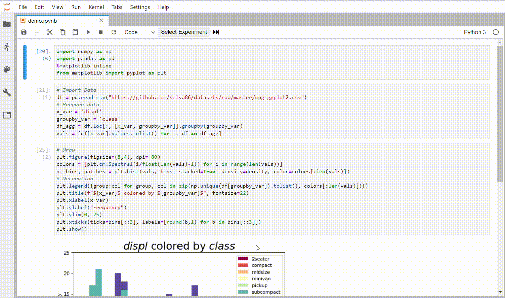

# JupyterLab-Experiments

Adds "experiments" to JupyterLab notebooks that allow a user to share experimental design and results easily in a single notebook.

Experiments are custom cell execution orders defined by the user that show exactly how a result is generated in the notebook. The experiments are saved as part of the meta-data of the notebook and can be easily shared. 

This extension adds a small set of UI elements to JupyterLab:
- A dropdown menu showing the available experiments
- Cell index labels

Although experiments are usually added after the code in a notebook is written, adding/removing/moving cells are smartly handled and the existing experiments are automatically updated to reflect changes to the notebook.

### Basic Usage

- Click on the "Select Experiment" button and use the dropdown menu to select an experiment to run or add an experiment.
- Adding an experiment requires a label ("L2 Regularization") and a cell execution order ("4-5-6-9-12-13-14-8"). The cell execution order must be a list of valid cell indices separated by the dash (-) character.
- Click the "fast forward" icon to run the selected experiment.


### Handling Changes

- Once a set of experiments are defined, changes to the order of the cells (add/remove/move) in the notebook will automatically update all experiments so that they point to the same cells.
- If all the cells that are part of an experiment are removed, the experiment will also be removed.
- To edit an existing experiment, enter the experiment label in the input field and assign it a new cell execution order.




## Prerequisites

* JupyterLab

## Installation

```bash
jupyter labextension install @haidark/experiments_ext
```

## Development

For a development install (requires npm version 4 or later), do the following in the repository directory:

```bash
npm install
npm run build
jupyter labextension link .
```

To rebuild the package and the JupyterLab app:

```bash
npm run build
jupyter lab build
```

## Authors

This extension was developed at the Rensselaer Polytechnic Institute [Data Science Research Center](www.dsrc.rpi.edu) in collaboration with [KhanTeT](http://khantet.com/) by [Haidar Khan Ph.D](https://haidark.github.io) and [Sadia Khan](https://github.com/sadiakk). 
